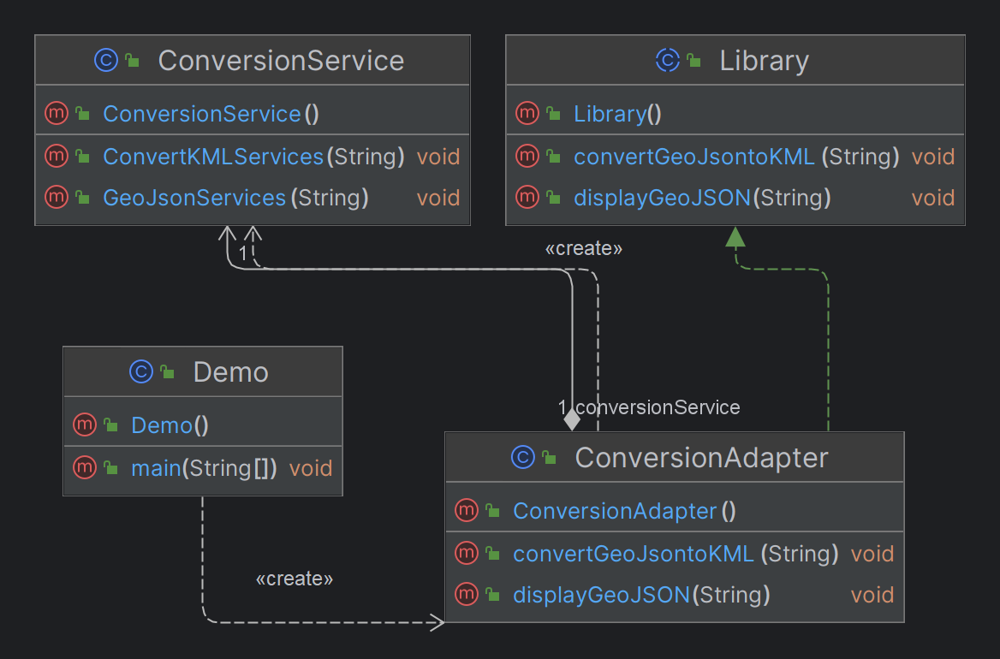

# Taller patrones de diseño
## Integrantes
Stephany Gaitán  
Luisa Galvis  
Santiago Arévalo  
Liseth Jimenez  
Jairo Cuartas
## Reportes
Patrón estructural: Template Method

## Biblioteca
Patrón estructural: Adapter

## Juego
Patrón creacional: Prototype

## Ejecutar la aplicación
Para ejecutar la solución a los problemas, abra el proyecto desde cualquier IDE para Java, ubiquese en el paquete que desee ejecutar y sobre la clase Demo.java, hacer clic derecho, seleccionar la opción Run As y luego 1 Java Application.

En el caso del paquete reports, la aplicación le pedirá que ingrese un número para continuar el proceso.   